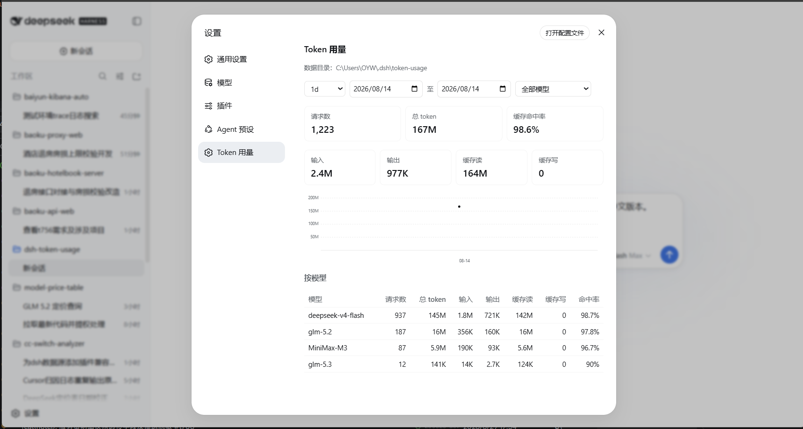

# dsh-token-usage

[](https://awesome-dsh-plugin.com)



[简体中文](./README.zh.md) | English

A dsh usage plugin that displays model token usage right in the Web UI. After installation, open **Settings** (the gear icon in the sidebar) and you'll find the **Token Usage** page — summary cards, a daily total-token line chart and a per-model breakdown, all filterable by date range and model, exactly as shown in the screenshot above.

[dsh]: https://github.com/cordiverse/dsh

Repo: <https://github.com/LaoYueHanNi/dsh-token-usage>

## Features

- **Live hook**: every successful model request is appended to per-day JSONL files (request id, model, input / output / cache-read / cache-write tokens, time, session id).
- **Web stats page**: filters (date range + model + `1d`/`7d`/`30d` shortcuts), summary cards, daily trend chart, per-model table.
- **Cost figures & model pricing**: per-request cost is computed live from per-model rates (¥ per million tokens) — a highlighted total-cost card, a cost column plus the per-model rates under each model name in the per-model table, and a warning strip for unpriced models (their cost counts as ¥0). The rate table is maintained by you in `pricing.json` inside the data directory; `/token-usage-pricing` prints the active table anytime.
- **History backfill**: the first startup syncs requests that happened before installation; the `/token-usage-sync` command re-runs the same idempotent backfill anytime.

## Model pricing

Cost = each token bucket × its rate ÷ 1,000,000. Rates live in `pricing.json` in the data directory (no pricing configured means every model is unpriced):

```json
{
  "deepseek-chat": { "inputPerMillion": 2, "outputPerMillion": 8, "cacheReadPerMillion": 0.5 },
  "deepseek-reasoner": { "inputPerMillion": 4, "outputPerMillion": 16, "cacheReadPerMillion": 1 }
}
```

- Keys are model ids (must match the recorded `model` exactly); values are ¥ per million tokens.
- `inputPerMillion` and `outputPerMillion` are required; `cacheReadPerMillion` (cache hit) and `cacheWritePerMillion` (cache write) are optional and fall back to the input rate when absent.
- A broken file or invalid entries leave the affected models unpriced without breaking the stats page; save and refresh (or re-run the command) to apply changes.
- Default location: `~/.dsh/token-usage/pricing.json` (wherever `path` points when configured).

## Install

### From GitHub (recommended)

```sh
dsh plugin --profile web add github:LaoYueHanNi/dsh-token-usage
```

> The package declares `dsh.bundle`, so `add` wires the plugin into the profile's layer stack automatically — no config editing needed. The built `lib/` ships in the repo (there is no `prepare` script), so git installs work out of the box without any build allowlist. The first startup runs one history backfill, afterwards it records in real time.

### From a local directory (development)

```sh
dsh plugin --profile web add link:D:/plugins/dsh-token-usage
```

`link:` installs a symlink: rebuild the plugin and restart `dsh web` to apply changes.

## Update

```sh
dsh plugin --profile web update dsh-token-usage
```

## Remove

```sh
dsh plugin --profile web remove dsh-token-usage
```

The plugin is removed from the profile and stops loading. Data files under `$DSH_HOME/token-usage/` are kept — delete them manually if you no longer need them.

## Development

Build the plugin once:

```sh
npm install
npm run build && npm run build:client
```

> **No `prepare` script — by design.** The compiled `lib/` output is committed to the repo. pnpm ≥ 10 refuses to run build scripts of git-hosted dependencies unless they are allowlisted (`ERR_PNPM_GIT_DEP_PREPARE_NOT_ALLOWED`), so a `prepare` script would break the zero-config `github:` install for every user. Shipping prebuilt output instead keeps `dsh plugin add github:LaoYueHanNi/dsh-token-usage` working out of the box. **After changing anything under `src/`, always rebuild and commit the updated `lib/`**, or installs will get stale output:

```sh
npm run build && npm run build:client
git add lib/
```

Temporary mount — effective for this launch only, no profile changes. `cordis.yml` points at the built `lib/index.js`:

```sh
dsh web --patch <plugin-dir>/cordis.yml
```

This mode only mounts the host half (data recording and commands work); the stats page needs the client bundle resolved by package name, so for UI development use the `link:` install above instead: run `npm run build && npm run build:client` (or `npx tsdown --watch` in the plugin directory), restart `dsh web`, and the browser plugin hot-reloads automatically.
