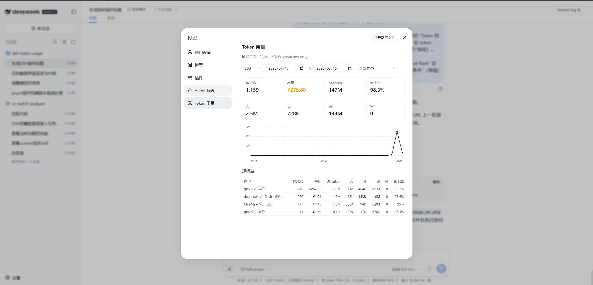
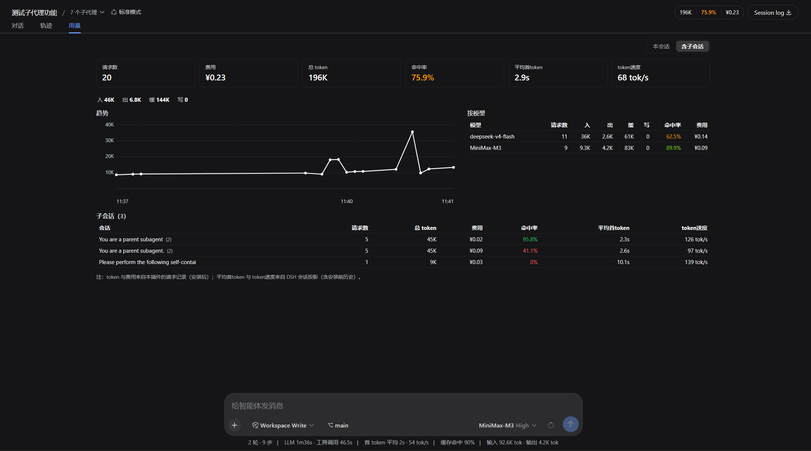
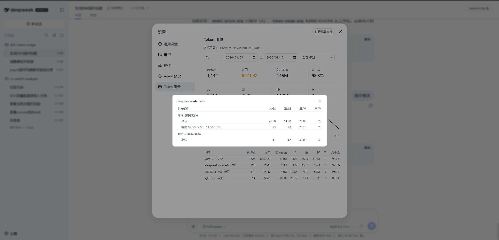
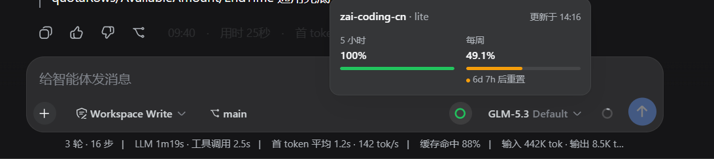
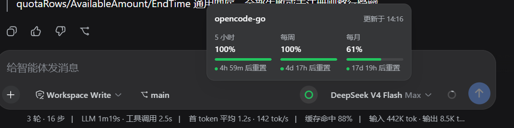

# dsh-token-usage

[](https://awesome-dsh-plugin.com)



简体中文 | [English](./README.md)

一个 [dsh] 用量插件：在 Web 界面直接展示模型 token 用量。安装后打开**设置**（侧栏底部齿轮），即可看到「Token 用量」页 —— 汇总卡片（含费用）、按日总 token 折线图、按模型明细表与定价弹窗，支持按日期区间和模型筛选，效果见上图。

[dsh]: https://github.com/cordiverse/dsh

仓库：<https://github.com/LaoYueHanNi/dsh-token-usage>

> [!IMPORTANT]
> **从 0.3.7 及更早的 GitHub 直装升级？** 0.3.8 起插件发布到 npm，包名变更为 `@laoyuehanni/dsh-token-usage`（原裸名在 npm 上已被第三方占用）。旧的 `github:` 安装**无法通过 `update` 升级**——包名已变，原地 update 会导致插件加载失败。从 0.3.8 开始使用，需先移除旧包名，再重新安装：
>
> ```sh
> dsh plugin --profile web remove dsh-token-usage
> dsh plugin --profile web add @laoyuehanni/dsh-token-usage
> ```
>
> 迁移不影响数据：`$DSH_HOME/token-usage/` 下的历史记录完整保留。
>
> **GitHub 直装已终止。** 仓库不再携带构建好的 `lib/` 产物：dsh 经 pnpm 安装 git 托管插件，而 pnpm 会拦截安装期构建，新的 `github:` 安装无产物可加载。请改从 npm 安装——包名不变，重跑上面的 `add` 命令即可把旧的 `github:` 安装切换到 registry。

## 功能

- **实时记录**：每一次 provider 计费调用追加一行到按天分片的 JSONL 文件（请求 id、模型、输入 / 输出 / 缓存读 / 缓存写 token、时间、会话 id）。
- **Web 统计页**：过滤条（日期区间 + 模型下拉 + `1d`/`7d`/`30d` 快捷区间）、汇总卡片、按日趋势图（悬停查看当日总量）、按模型明细表。
- **会话用量页签**：对话面板新增「用量」视图页签（与聊天 / 轨迹并列），展示当前会话的 token 与费用 dashboard —— 六张数值卡（请求数、费用、缓存命中率、首 token 平均延迟、出字速度、总 token）+ 四项 token 明细条 + 按小时趋势图 + 按模型表；支持「本会话 / 含子会话」范围切换（子会话子树聚合到一次请求），子会话表逐行展示（请求数、总 token、费用、命中率、首 token、速度），点击行钻取到该子会话并可逐级返回。token 与费用走插件自己的计费链（安装后记录），首 token 与出字速度读 DSH 的 `sessionStats` 会话投影（含安装前历史）；会话无记录时优雅降级为占位文案。



- **费用统计与模型定价**：按模型单价（¥/百万 token）实时计算费用 —— 汇总卡醒目展示总费用，按模型表每行带费用列，未定价模型高亮提示（费用按 ¥0 计）。定价模型的名字旁有**「定价」小按钮**，点击弹窗展示该模型的完整价格表：**每行一个计费条件**（默认价、上下文档位 `≥ 512K`、峰谷时段 `09:00-12:00`、限时规则的日期窗口分组），条件对应的入/出/缓/写四价各自成列，与逐条计费的解析规则一一对应。定价由云端镜像与手工文件合并而来：启动时自动从 model-price-table（cc-switch-analyzer 同源）拉取镜像，`pricing.json` 手工覆盖/补充。
- **供应商配额**：输入栏模型选择器左侧有配额按钮，跟随当前选中的供应商展示套餐余量。智谱 GLM / Kimi / MiniMax / OpenCode Go 显示时间窗口进度，DeepSeek / OpenRouter 显示账户余额。详见「[供应商配额](#供应商配额)」。
- **历史补齐**：首次启动自动同步安装前已发生的请求（幂等）。

## 模型定价



**逐条请求精确计费**：每条记录按自身时间戳走 cc-switch-analyzer 同款规则链——时间区间规则（`timeRules`）优先，命中后用规则内上下文档位（`contextTiers`）与峰谷价（`dailySlots`）；未命中走模型根的档位 → 峰谷 → 基础价。档位匹配以上下文 token 量近似（本请求 input + cacheRead + cacheWrite）。定价表更新价格后，全部历史按新价即时重算，无需重建数据。定价来自两个文件，读取时合并，`pricing.json` 的条目永远优先（整模型覆盖，含禁用其云端规则）：

| 文件 | 来源 | 说明 |
|---|---|---|
| `pricing.ccsa.json` | 启动自动拉取 | 云端 model-price-table（cc-switch-analyzer 同源）的本地镜像，每次重启 dsh 自动刷新，失败时沿用旧镜像 |
| `pricing.json` | 手工编辑 | 覆盖同步价或补充缺失模型，手动微调不会被同步冲掉 |

云端 feed 格式（`currency` 须为 `RMB`；`modelId` 与 `aliases` 都会展开为可匹配的键；`timeRules` / `contextTiers` / `dailySlots` 全部参与计费）：

```json
{
  "version": 4,
  "updatedAt": 0,
  "currency": "RMB",
  "models": [
    { "modelId": "deepseek-chat", "inputCostPerMillion": 2, "outputCostPerMillion": 8,
      "cacheReadCostPerMillion": 0.5, "cacheCreationCostPerMillion": 1, "aliases": ["deepseek-v3"] }
  ]
}
```

`pricing.json` 的扁平格式（键为模型 id、与记录中的 `model` 完全一致；`inputPerMillion`、`outputPerMillion` 必填，`cacheReadPerMillion` / `cacheWritePerMillion` 可选、缺省按输入价计费）：

```json
{
  "deepseek-chat": { "inputPerMillion": 2, "outputPerMillion": 8, "cacheReadPerMillion": 0.5 }
}
```

文件损坏或条目非法时对应模型按未定价处理，不影响统计页；保存后刷新页面即可生效。默认数据目录：`~/.dsh/token-usage/`（配置了 `path` 时以该目录为准）。

### 修改数据目录

数据目录可在 Web 设置里直接修改：**设置 → 插件**页签下折叠的 **Token 用量** 卡片内，「数据目录」输入框留空表示默认位置（`~/.dsh/token-usage/`），填入绝对路径并保存后**立即生效**——历史数据自动迁移到新目录（按文件原样复制，完成后自动切换并清理旧目录），无需重启，也无需手动搬数据。

输入框旁的「**浏览…**」按钮打开目录选择器——复用 dsh 框架自带的目录选择能力（与工作区流程同一个选择器，经 `ctx.workspaces.pickDirectory()` 驱动）：本机桌面走系统原生对话框，远程/无桌面环境自动切换为应用内浏览。选中的路径只填入暂存草稿，仍需点「保存」才提交。

迁移采用两阶段提交（先全部复制、再切换、最后清理），任何一步失败数据都只会同时存在于两份或仅留在原目录，绝不会只存于新目录。**对话进行中时无法保存目录修改**——事件只在一轮对话（turn）进行期间追加，所以只把「正在交互的对话」当作障碍，空闲开着的对话标签绝不阻止保存——卡片在保存前经 `/token-usage/dir-guard` 路由预检（判定依据是对话是否仍在交互），直接拒绝本次保存并在失败提示行显示当前进行中的对话数，设置不落盘；等待对话结束后再次保存即可完成迁移。统计缓存 `rollup.json` 是派生数据，不随迁移，切换后首次统计读取会自动重建。也可用配置项直接指定：

```yml
# 插件 profile 配置里
plugins:
  token-usage:
    path: D:/data/token-usage   # 缺省：~/.dsh/token-usage/
```

### 选择定价镜像

启动同步默认拉 **Gitee**（中国大陆内速度快）。中国大陆以外的安装可把同步切到同一张表的 **GitHub 镜像** —— 既可在 Web 设置里改（同一张 **Token 用量** 卡片内的「定价区域」下拉，保存后立即生效），也可用一行配置。不做 IP 探测，部署者装的时候手动选一次即可：

```yml
# 插件 profile 配置里
plugins:
  token-usage:
    pricingRegion: overseas   # 默认：domestic
```

Web 卡片提供数据目录与地区切换两项；全部配置项（均为可选）：

| 配置项 | 默认 | 含义 |
|---|---|---|
| `path` | `~/.dsh/token-usage/` | 数据目录（Web 卡片可改，保存即迁移） |

| 配置项 | 默认 | 含义 |
|---|---|---|
| `pricingUrl` | — | 显式指定单个 feed（仅 cordis.yml 可设），优先级最高，覆盖下面所有项 |
| `pricingUrlDomestic` | Gitee feed | 国内镜像覆盖（仅 cordis.yml 可设；自维护 fork 用） |
| `pricingUrlOverseas` | GitHub 镜像 | 国外镜像覆盖（仅 cordis.yml 可设；自维护 fork 用） |
| `pricingRegion` | `domestic` | `domestic` → Gitee，`overseas` → GitHub（`pricingUrl` 未设置时生效） |

自己维护 model-price-table fork 时，用 `pricingUrlDomestic` / `pricingUrlOverseas` 指到你的地址。保存地区切换后立即重新同步；**不自动回退**：选定的镜像拉取失败就沿用旧镜像，等待下次同步重试。

**区域联动货币展示**：地区切换同时决定统计页的费用展示货币——选「国内 / 默认（Gitee）」时费用按人民币展示（`¥` + 原表数字）；选「全球（GitHub）」时按美元展示（`$` + `RMB ÷ 汇率`）。汇率取定价表最顶层的 `usdExchangeRate` 字段（人民币兑 1 美元的换算率），当前表里为 `7`；镜像尚未携带该字段时回退用内置默认值 `7`。涉及到的每处金额都会联动：汇总总费用、按模型费用列、未定价提示，以及「定价」弹窗里的入/出/缓/写 单价（美元模式下列表下方会标注换算汇率）。线协议上传输的金额始终是人民币数值，换算只在展示层进行，切换区域不用重建任何统计。

## 供应商配额

输入栏按钮跟随当前选中的供应商，点开即可查看套餐余量（与推理共用同一把 API Key）：





| 供应商 | 展示 |
|---|---|
| 智谱 GLM Coding Plan（国内 / 国际） | 5 小时、每周（部分套餐另有每月） |
| Kimi For Coding | 5 小时、每周 |
| MiniMax Coding Plan（国内 / 国际） | 5 小时、每周 |
| OpenCode Go | 5 小时、每周、每月 |
| DeepSeek（官方） | ¥ 账户余额 |
| OpenRouter | $ 剩余额度 |

不支持的供应商不显示该按钮。查询失败时可在面板内重试。默认开启，可用 `quota.enabled: false` 关闭。

暂不支持：火山方舟、ZenMux、智谱团队版、Claude / Codex / Gemini / Grok 官方订阅、GitHub Copilot。


## 安装

### 从 npm 安装

```sh
dsh plugin --profile web add @laoyuehanni/dsh-token-usage
```

> 包声明了 `dsh.bundle`，`add` 会自动把插件挂进 profile 的层栈，无需手动改配置。构建产物 `lib/` 随 npm 包分发，安装开箱即用，无需任何构建步骤。首次启动自动补齐一次历史记录，之后纯实时记录。

### 从本地目录安装（开发调试用）

```sh
dsh plugin --profile web add link:D:/plugins/dsh-token-usage
```

`link:` 安装的是符号链接：重新构建插件后重启 `dsh web` 即可生效。

## 更新

```sh
dsh plugin --profile web update @laoyuehanni/dsh-token-usage
```

## 移除

```sh
dsh plugin --profile web remove @laoyuehanni/dsh-token-usage
```

插件会从 profile 移除并停止加载。数据文件（`$DSH_HOME/token-usage/`）会保留，需要时手动删除。

## 开发

先构建一次插件：

```sh
npm install
npm run build && npm run build:client
```

> **刻意不设 `prepare` 脚本。** 编译产物 `lib/` 已提交进仓库并随 npm 包分发。pnpm ≥ 10 默认拒绝执行依赖的构建脚本，除非加入白名单，因此若保留 `prepare`，pnpm 用户的安装会跳过或失败。改为分发预构建产物后，`dsh plugin add @laoyuehanni/dsh-token-usage` 才能零配置开箱即用。**改动 `src/` 下的任何文件后，务必重新构建并提交更新后的 `lib/`**（并发布新版本），否则别人安装到的是旧产物：

```sh
npm run build && npm run build:client
git add lib/
```

临时挂载 —— 仅当次启动生效，不动 profile，`cordis.yml` 指向构建产物 `lib/index.js`。`cordis.yml` 是机器本地的（含你 checkout 的绝对路径），不进 git：先从模板复制一份，并把 `name` 改成你机器上 `lib/index.js` 的绝对 `file://` URL：

```sh
cp cordis.example.yml cordis.yml   # 然后编辑其中的 name 路径
dsh web --patch <插件目录>/cordis.yml
```

此模式只挂载 host 半边（数据记录照常工作）；统计页依赖按包名解析的客户端 bundle，因此开发 UI 请用上面的 `link:` 安装方式：执行 `npm run build && npm run build:client`（或在插件目录跑 `npx tsdown --watch`）并重启 `dsh web` 后，浏览器端插件会自动热重载。
